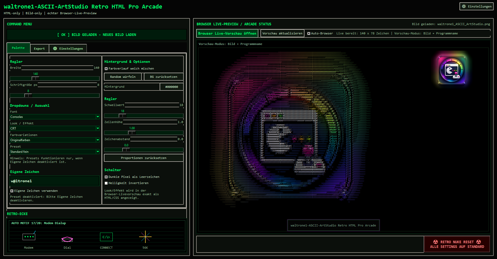

# WALTRONE ASCII ArtStudio

**waltrone1 ASCII ArtStudio** is a free retro ASCII art generator and export tool for Windows by **WALTRONE**.

It helps you convert images into colorful ASCII artwork and export the result as HTML, SVG or PNG.

The tool is designed for Windows users, creators, retro fans, admins, technicians and hobby projects that need a fast visual way to create terminal-style artwork, arcade graphics, neon ASCII visuals or shareable image-based ASCII designs.

---

## Screenshot



The screenshot shows the main application window for converting images into retro ASCII artwork and exporting the result as HTML, SVG or PNG.

---

## Features

- Image to ASCII conversion for common image formats
- Support for JPG, PNG, BMP, GIF and WEBP images
- Multiple ASCII character presets
- Custom character set support
- Optional custom WALTRONE / handle based character output
- Original image colors or retro color palettes
- Matrix, amber, cyber, arcade, neon and CRT-inspired palettes
- Retro CRT, glow, glitch, terminal and arcade-style effects
- Adjustable ASCII width
- Adjustable font size, line height and letter spacing
- Dark-pixel transparency and empty-space handling
- Live browser preview for HTML output
- Automatic browser preview updates while editing
- HTML export for web pages and documentation
- Standalone HTML export
- Embed HTML export for existing pages
- SVG / vector export
- PNG export
- Optional transparent PNG export
- Terminal frame export mode
- Clean art-only export mode
- Branded export mode
- Retro arcade motif support
- Copyable ASCII output in HTML exports
- Windows-focused desktop interface based on tkinter
- Application icon
- py2exe / PyInstaller build files for creating a Windows executable

---

## Use Cases

This tool can be useful for:

- Creating retro ASCII artwork from images
- Creating terminal-style graphics
- Creating arcade, CRT, matrix or neon styled image effects
- Generating HTML ASCII art for websites
- Creating transparent PNG ASCII visuals
- Exporting scalable SVG ASCII artwork
- Preparing visuals for documentation or project pages
- Creating nostalgic graphics for posts, pages or readme files
- Testing custom character sets such as names, handles or brands
- Creating fun visuals for personal, educational or creative projects
- Building small retro-style web design elements
- Producing shareable ASCII graphics without manual text editing

---

## Project Status

This project is currently available as a public release.

The repository provides source files, documentation, screenshots and build-related files for transparency and community access.

Current version:

```text
1.0.0.0
```

---

## Download

You can download the latest release from the GitHub Releases section.

A WALTRONE download/support page may also be available for users who prefer a simple download option or want to support the project voluntarily.

---

## Repository Structure

```text
waltrone1-ascii-artstudio/
|
|-- README.md
|-- CHANGELOG.md
|-- LICENSE
|-- .gitignore
|
|-- docs/
|   `-- usage.md
|
|-- screenshots/
|   `-- ascii-artstudio-main.png
|
|-- py2exe/
|   `-- build files for creating a Windows executable
|
|-- requirements.txt
|-- run.py
|-- waltrone1-ASCII-ArtStudio.py
|-- version_info.txt
`-- waltrone1-ASCII-ArtStudio.ico
```

The main start file is:

```text
run.py
```

The additional source file is:

```text
waltrone1-ASCII-ArtStudio.py
```

The `py2exe/` folder contains build-related files for creating a Windows executable.

Generated files such as `.exe`, `.zip`, `build/`, `dist/`, `.venv/` or release folders should not be committed directly to the repository.

Final release packages should be published through GitHub Releases.

---

## Basic Usage

1. Download the latest release.
2. Extract the ZIP file completely.
3. Start the application.
4. Load an image.
5. Choose an ASCII character set.
6. Select a palette, effect and export mode.
7. Adjust width, font size, spacing and transparency options if needed.
8. Open the browser live preview if needed.
9. Export the result as HTML, SVG or PNG.
10. Review exported files before publishing or sharing them.

---

## Build / Source Notes

The source files are available in the repository for transparency and review.

If the project is started from source, install the required dependency first:

```text
pip install -r requirements.txt
```

Then start the application with:

```text
python run.py
```

Build-related files for creating a Windows executable are located in:

```text
py2exe/
```

On Windows, the included build script can be used from the `py2exe` folder:

```text
build_exe_windows.bat
```

Generated build output such as `.exe`, `.zip`, `build/`, `dist/` or release folders should not be committed directly to the repository.

Final release packages should be published through GitHub Releases.

---

## Safety Notes

waltrone1 ASCII ArtStudio is a creative image conversion and export tool.

It does not automatically upload images, publish files or modify original image files.

Important notes:

- Very large images can take longer to process.
- Export size depends on width, font size, scale and output format.
- Some fonts may render differently depending on the system.
- HTML output uses CSS effects and may look slightly different across browsers.
- SVG and PNG exports can become large when using very high detail settings.
- Transparent PNG output should be checked before use in other designs.
- Always check exported files before publishing them.
- Use only images you are allowed to process and publish.
- Retro names, console references and arcade-style motifs are used as creative references only.
- This project is not affiliated with any trademark owners.

---

## License

This project is released under the **WALTRONE Community License**.

You may use this tool for free.

However, the following is not allowed without written permission:

- Commercial resale
- Rebranding
- Selling modified versions
- Commercial integration into paid products or services
- Republishing the project under another name
- Removing WALTRONE branding or author information

For details, see the `LICENSE` file.

---

## About WALTRONE

**WALTRONE** is a GitHub and community project focused on small, useful tools for Windows, automation, productivity and system management.

GitHub handle / domain identity:

```text
waltrone1
```

Project brand:

```text
WALTRONE
```

---

## Support

This tool is free to use.

If you find it useful, you may support the project voluntarily through the official WALTRONE download/support page.

---

## Disclaimer

This tool is provided as-is, without warranty of any kind.

Use it at your own risk.

The author is not responsible for data loss, incorrect exports, browser rendering differences, publishing decisions, copyright issues caused by user-provided images, system issues or damages caused by the use of this software.
